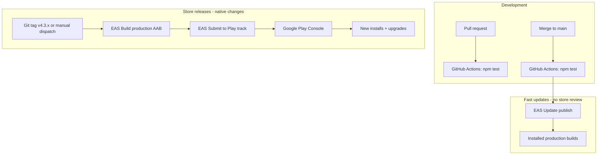

# Release and deployment

Authoritative docs for shipping Gridly to app stores and maintaining releases. Product behavior specs remain in the parent `specs/` directory.

**Current Play Store effort:** v4.3.1 first public Android release (`com.gridlygames.app`).

## Documents

| Document | Description |
|----------|-------------|
| [google-play.md](./google-play.md) | Play Store runbook, phase checklist, credentials, CI/CD |
| [versioning.md](./versioning.md) | Unified semver across app, specs, tags, and Play Store |
| [../../docs/store/play-store-listing.md](../../docs/store/play-store-listing.md) | Copy-paste store listing text and Play Console answers |
| [../../docs/legal/privacy-policy.md](../../docs/legal/privacy-policy.md) | Privacy policy source (canonical hosted copy linked below) |
| [../../docs/legal/delete-account.md](../../docs/legal/delete-account.md) | Delete-account page source for Play Console |

## Published URLs

| Asset | URL |
|-------|-----|
| Privacy policy (live) | https://sites.google.com/view/shaunakstudios-gridly/home |
| Delete account (live) | https://sites.google.com/view/shaunakstudios-gridly/delete-account |
| Play Store listing | Complete in Console (Aug 2026); public page after first release |

## Release pipeline



## Phase status (Play Store v4.3.1)

| Phase | Status | Notes |
|-------|--------|-------|
| 0 — Play Console prep | **Complete** | Store listing live |
| 1 — EAS credentials | **Complete** | Service account + production env vars |
| 2 — Repo config | **Complete** | v4.3.1, `eas.json`, `expo-updates` |
| 3 — CI/CD | **Complete** | Workflows added; `EXPO_TOKEN` optional |
| 4 — Closed testing | **In progress** | Submitted + in review; need opt-in URL and 12 testers |
| 4b — Production access | **Blocked** | Requires 12 testers × 14 days closed test |
| 5 — Steady state | Not started | OTA + tagged store releases |

**Current milestone:** Wait for closed testing approval → share opt-in URL → recruit 12 testers → run 14-day closed test → apply for production.

## Quick commands (when configured)

```bash
npm run build:production          # after Phase 2
npm run build:production:submit   # build + submit to Play
npm run update:production         # EAS Update OTA (after expo-updates)
npm run supabase:deploy-invites   # redeploy after deepLink package changes
```
